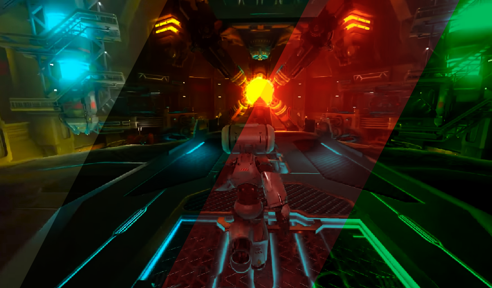
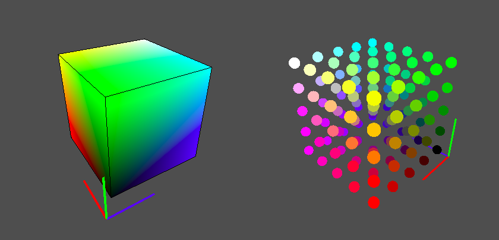

# Godot Color LUT Shader

Color Grading with LUT shader for Godot 3.

This shader maps all rendered pixels and convert their colors according to a provided 3D lookup table (LUT) texture. It's a highly efficient color correction method for real-time applications in Godot.

## Usage

### Shader

1. Create an instance of "src/ColorGradingFilter.tscn" scene into your desired scene.
2. In the Inspector, look for "_Material -> Material_", right click in "Shader Material" and click in "Make Unique"
3. Now left click in the Shader Material, open the "_Shader Param_" tab and replace the *Lut* field for your desired LUT
4. Resize the control to cover the whole screen

### Screenshot Plugin

To assist in the creation of the LUTs, the **screenshot plugin** enables taking screenshots while playing the project and preparing it for color correction in an external tool by placing an identity LUT in the top left corner of the generated image.

#### How to install

1. Copy the folder "color_grading_lut" from "addons" to your project's "addons" folder.
2. Go to _Project Settings -> Plugins_ and change the status from "Color Grading LUT Assist Tool" to *Active*.

#### How to use

1. Place a **ColorGradingTool node** into your scene (_Add Child Node -> ColorGradingTool_)
2. **Press the Play button** in the editor
3. **Press F11** to take the screenshot. It'll go to the root folder of your project.

With this screenshot in hands, you can use your preferred image editor to apply your color transformations. In the end, just crop the upper-left corner of your image to get your final LUT (256x16 pixels by default).

## Implementation

*Demo for **RGB Cube visualization and discretization**: https://www.openprocessing.org/sketch/744896*

This fragment shader uses a precomputed lookup table mapping the RGB domain to match your current pixel color with its respective position in the lookup and swap it with lookup's one.

For the values that are not present in the table, a linear interpolation is made using the surrounding color samples to create an approximated value.

As we only look at the lookups to create this effect, this method can acquire the same result of multiple real-time color operations with only an inexpensive texture read cost.

## References

- Adrian Courrèges' Metal Gear Solid V Graphic Study: http://www.adriancourreges.com/blog/2017/12/15/mgs-v-graphics-study/
- NVIDIA's GPU Gems - Lookup Tables to Accelerate Color Transformations: https://developer.nvidia.com/gpugems/GPUGems2/gpugems2_chapter24.html
- Wikimedia 6-bit RGB Cube that encouraged my application in Open Processing: https://commons.wikimedia.org/wiki/File:6-bit_RGB_Cube.gif 
- Herman Tulleken's Gamasutra article regarding the effect of color usage in games: https://www.gamasutra.com/blogs/HermanTulleken/20150729/249761/Color_in_games_An_indepth_look_at_one_of_game_designs_most_useful_tools.php 
- SuperCinema's analysis of movie's color palette (in portuguese):
    - Mad Max Fury Road: https://www.youtube.com/watch?v=MDJ0xjwzC5M
    - Birdman: https://www.youtube.com/watch?v=eNYzZ1hXDKo&t=494s

